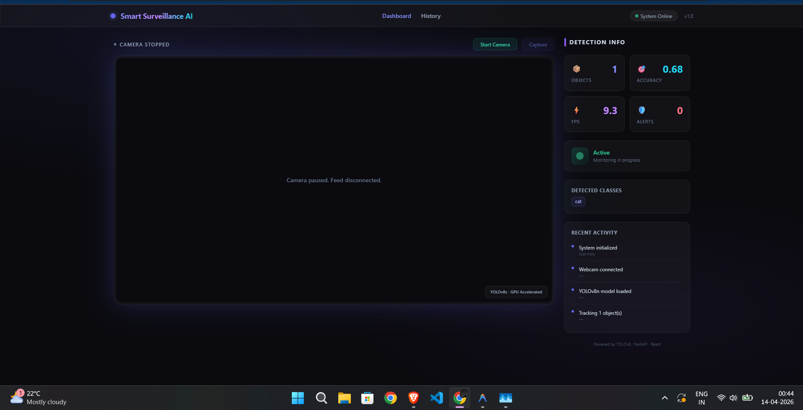
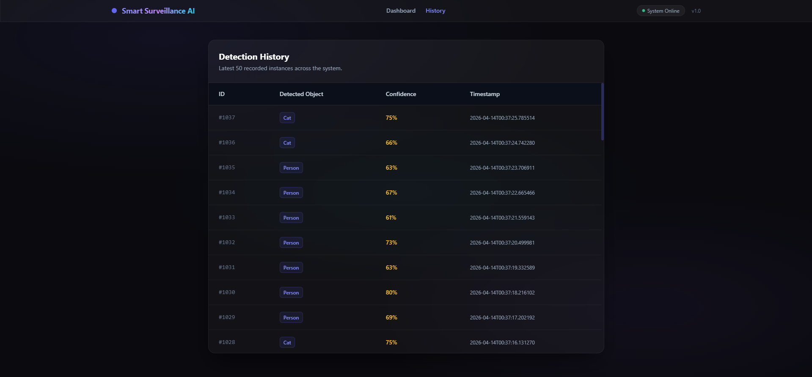

# Obkect Detection System

A full-stack, real-time surveillance platform that streams live video, performs object detection using YOLOv8, and logs detection events using a dual-database architecture.

---

## Demo




---

## Overview

This system transforms a standard webcam or IP camera into an intelligent monitoring solution. It captures live video, processes each frame using a deep learning model, and displays annotated results through a web-based dashboard. All detections are stored with timestamps and confidence scores for later analysis.

---

## Key Features

* Real-time video streaming from webcam or IP camera
* High-speed object detection using YOLOv8
* GPU acceleration with automatic fallback to CPU
* Live system metrics such as FPS, object count, and confidence
* Detection history with timestamps and classification details
* Snapshot capture functionality
* Camera control (start and stop) from the interface
* Dual database system using SQLite and MongoDB

---

## Tech Stack

### Backend and AI

* Python
* FastAPI
* OpenCV
* PyTorch
* Ultralytics YOLOv8

### Frontend

* React (Vite)
* Tailwind CSS
* Framer Motion

### Databases

* SQLite
* MongoDB

---

## System Workflow

1. Capture frames using OpenCV
2. Run YOLOv8 inference on each frame
3. Draw bounding boxes and labels
4. Stream processed frames via MJPEG
5. Log detection events into the database

---

## Project Structure

```
├── backend/        # FastAPI server and detection pipeline
├── frontend/       # React dashboard
├── database/       # Database configuration
├── assets/         # Screenshots
└── README.md
```

---

## Setup Instructions

### Clone the Repository

```bash
git clone https://github.com/your-username/Object-Detection-System.git
cd Object-Detection-System
```

---

### Backend Setup

```bash
cd backend
pip install -r requirements.txt
uvicorn main:app --reload
```

---

### Frontend Setup

```bash
cd frontend
npm install
npm run dev
```

---

## Usage

* Open the application at: http://localhost:5173
* Start the camera from the dashboard
* View real-time object detection
* Navigate to the history section to review past detections

---

## Future Improvements

* Real-time alert system (email or SMS)
* Cloud deployment (AWS, GCP, or Azure)
* Mobile application integration
* Custom-trained object detection models

---

## Author

Sanket-x

